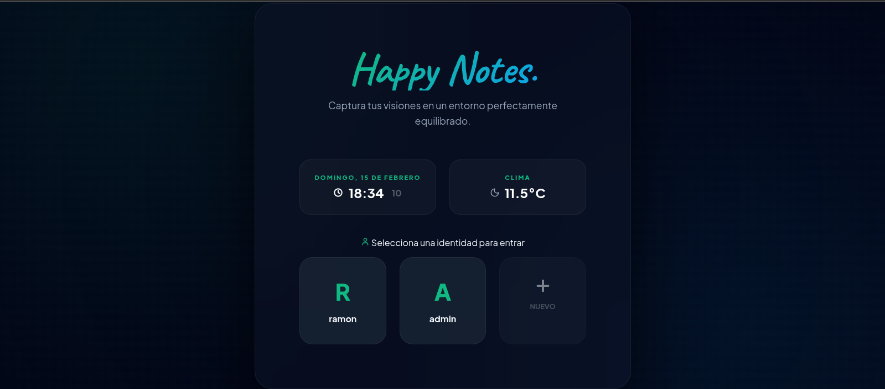
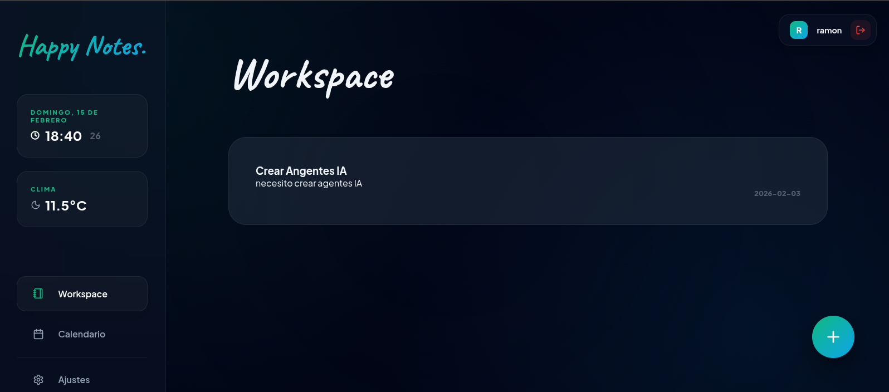
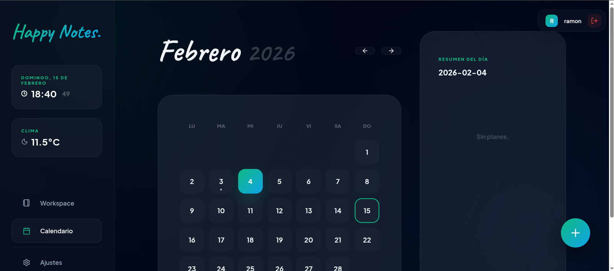
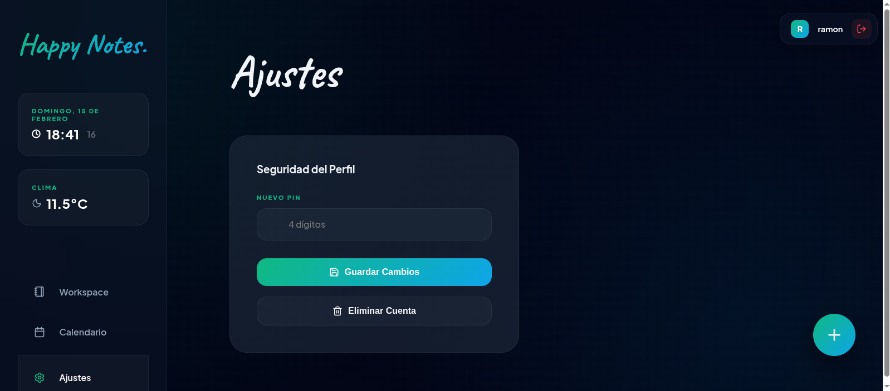

# 🌿 Happy Notes - UI UX Pro Max Edition

¡Bienvenido a **Happy Notes**! Una experiencia de productividad inmersiva, elegante y segura, diseñada para capturar tus ideas con un estilo **Slate Emerald** de alta gama.



## 🌟 Características Pro-Max

- **🌐 Sincronización Multi-Dispositivo**: Base de datos centralizada en **SQLite** que permite acceder a tus notas desde cualquier dispositivo de la red local.
- **🚀 Arquitectura Full-Stack**: Integridad de datos gestionada por un servidor Node.js/Express de alto rendimiento.
- **💎 Estética Sovereign Symmetry**: Interfaz basada en cuadrículas Bento y Glassmorphism de última generación con desenfoques de 64px.
- **🖋️ Tipografía Curada**: Combinación perfecta de *Plus Jakarta Sans* para la interfaz y *Caveat* para tus pensamientos más personales.
- **📱 Experiencia Fluida**: Animaciones con curvas de aprendizaje `cubic-bezier` y diseño responsivo adaptativo.

## 📸 Galería de la Aplicación

### 🔐 Gestión de Perfiles y Acceso

*Pantalla de inicio con simetría axial y detección de ubicación.*

### 🚀 Notas del Día (Workspace)

*Tu centro de creación minimalista con organización por tarjetas inteligentes.*

### 📅 Calendario Soberano

*Planifica tu tiempo con una vista de calendario integrada y Physics de cristal.*

### ⚙️ Ajustes de Seguridad

*Panel avanzado para gestionar tu PIN y la integridad de tu cuenta.*

## 🚀 Instalación y Uso

1. **Clonar el repositorio**:
   ```bash
   git clone https://github.com/monlow99/happy-notes.git
   cd happy-notes
   ```

2. **Instalar dependencias**:
   ```bash
   npm install
   ```

3. **Iniciar la Aplicación Completa**:
   ```bash
   ./start.sh
   ```
   Este script inicia automáticamente tanto el servidor de base de datos como el frontend.

   **Alternativamente**, puedes ejecutarlos por separado:
   - Terminal 1 (Base de Datos): `npm run server`
   - Terminal 2 (Frontend): `npm run dev`
   
   *Nota: Al usar HTTPS local, el navegador te pedirá confirmar el certificado de seguridad. Haz clic en "Avanzado" y "Continuar".*

4. **Acceso**: 
   - **Local**: [https://localhost:5174/](https://localhost:5174/)
   - **Desde otros dispositivos**: `https://[IP-DE-TU-PC]:5174/`

## 🛠️ Stack Tecnológico

- **React 19** - El corazón de la reactividad.
- **Vite 5** - Bundler ultra-rápido con soporte SSL nativo.
- **Lucide React** - Iconografía profesional y consistente.
- **Vanilla CSS** - Diseño puro con variables y efectos Pro-Max.
- **Open-Meteo & OpenStreetMap** - Datos ambientales en tiempo real.

---
*Diseñado con ❤️ para elevar el estándar de tus notas diarias.*
